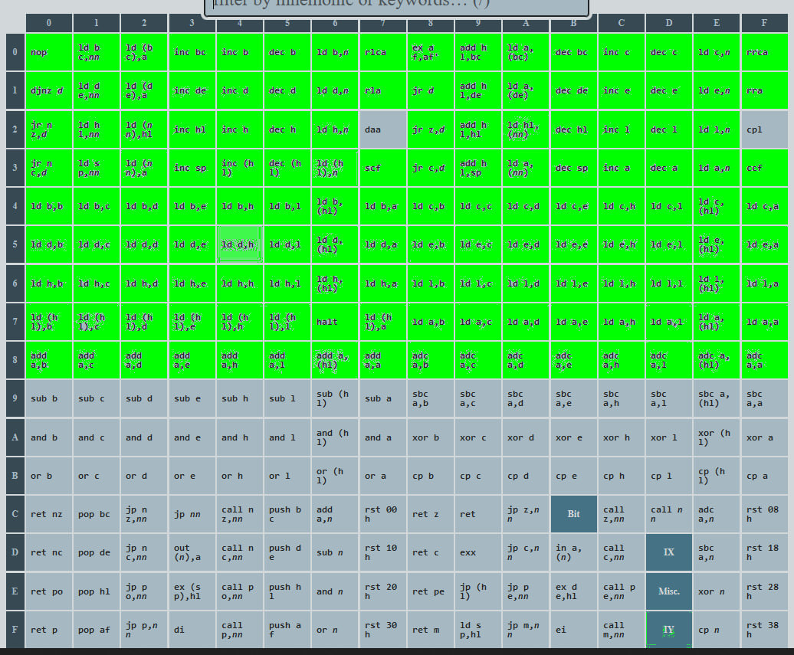

# z80cs
Reimplementing the Z80 CPU in C#.

Current progress:

Base instructions: 110/256

Misc. instructions (0xED): 0/56

Bit instructions (0xCB): 0/248

IX instructions (0xDD): 0/41

IX bit instructions (0xDDCB): 0/30

IY instructions (0xFD): 0/41

IY bit instructions (0xFDCB): 0/30

